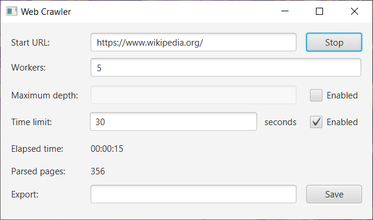

# Web Crawler

A window application using JavaFX framework
that implements a web crawler with follow features:
* start/stop crawling pages button
* set start URL
* set number of workers (>= 1) - threads running in the background
* set maximum depth - decides how deep in Internet workers should go
* set time limit - workers end work after time limit
* show number of parsed pages and workers current running time
* export crawled page as file to specific directory

Web crawler searches pages for their title and links based
on HTML tags and tag's properties like:
* `<title></title>` - tag: title
* `<a href=""></a>` - tag's property: href

---

## Screenshot



---

## Technology
* Java SE
* JavaFX
* Apache Maven

---

## Requirements
* Java SE 14 JRE installed
* Apache Maven 3.6.x installed (at least)

---

## Building & Running
Example for Linux system
```
git clone https://github.com/dmarcini/web-crawler
cd web-crawler
mvn package

java -jar target/web-crawler-1.0-SNAPSHOT.jar
```

---

## Sources
Project was based on Jetbrains Academy tutorial - Web Crawler: </br>
https://hyperskill.org/projects/59